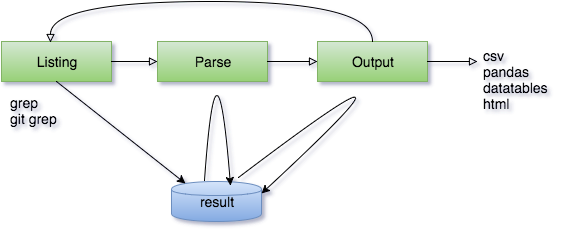

# grep-result

It is utilities for the grep and after.  
grep-result has 3 parts.
- `Listing` is grep and over write result.
- `Parse` is modify result per one record.
- `Output` is modify result whole and output(e.g. csv,pandas,datatables,html...).

<p align="center">

</p>

## Install

```
pip install grep-result
```

## Usage

please see example.py

